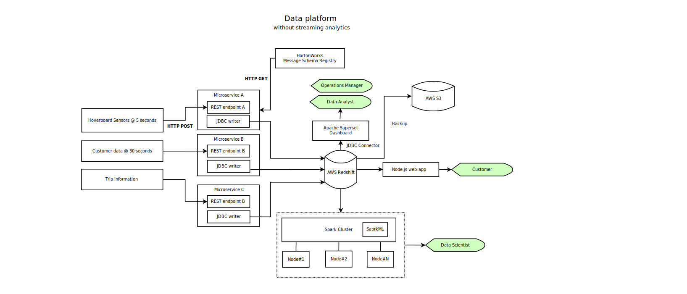
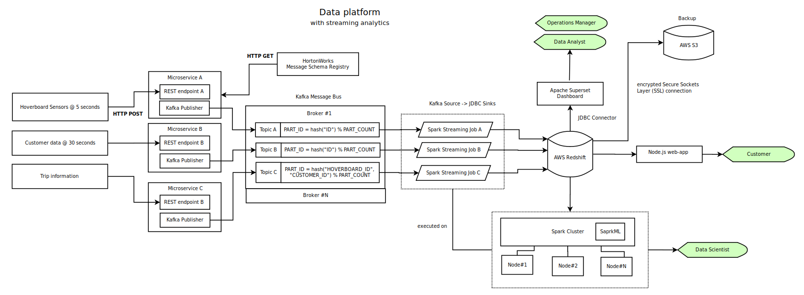
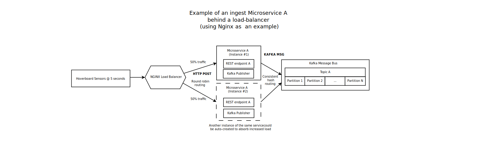

# Architectural Exercise

Contains design proposal for the data platform

## Version 1: Architecture without real time analytics
Below is the version of architecture proposal without streaming/streaming analytics.
In this case JDBC writer will directly write to AWS Redshift.


### Key features
- sensor data is being pushed to REST endpoints
- separately configured instances of the same microservice are handling different message types
- schema registry service is used as a source of message schemas (JSON Schema format)
- each microservice instance persists data to a corresponding table in AWS Redshift
- once data landed in AWS Redshift, it is available for several usage scenario:
  * operations manager and data analyst could access through a web based analytical dashboard powered by Apache
  * data scientist would be able to build statistical models using Spark cluster (sourcing data using a Spark connector using AWS Redshift)
  * customer has access to his/her information via a Node.js Webapp that talks to AWS Redshift
- monitoring is accomplish using ELK stack which is listening to events coming from different components 

### Components & responsibilities
- Spark: extension of the core Spark API that enables scalable, high-throughput, fault-tolerant data processing 
- AWS Redshift: fast, fully managed, petabyte-scale data warehouse
- AWS S3: storage service use for backup of AWS Redshift
- Apache superset dashboard: modern BI app with a simple interface, feature-rich when it comes to views, that allows the user to create and share dashboards.
- HortonWorks message schema registry:shared repository of schemas that allows applications to flexibly interact with each other.
- ELK: monitoring
- Spark cluster

### Data platform without streaming analytics


### Monitoring layer


## Version 2: Architecture with real time analytics

### Additional features
- Kafka publishers publish message in topic from microservice to Kafka message bus
- 3 main topics in this exercise: 
    * hoverboard
    * customer 
    * trip
- we want to preserve the ordering of sensor data based on certain part of the message (e.g. "id") while improving reading and writing parallelism,
the following partitioning strategy based on consistent hashing was suggested:
    * number of partitions N_PART is fixed at a reasonable level (e.g. N_PART=100)    
    * *'hoverboard'* topic: PART_ID = hash("id") % N_PART 
    * *'customer'* topic: PART_ID = hash("id") % N_PART 
    * *'trip'* topic:   PART_ID = hash("hoverboard_id", "customer_id") % N_PART
- Spark streaming job with different configs is used to load from Kafka
topic to AWS Redshift
- __data scientist has now an option to test and deploy streaming version 
of his/her models, e.g. using relation between hoverboard, customer and trip
online failure detection algorithms that are available in SparkML library__

### Additional components & responsibilities
- Kafka message bus: distributed streaming platform that is used publish and subscribe to 
streams of records. It is horizontally scalable, fault-tolerant and fast.
 
*Note*: 
Below architecture gives scalability, low latency and high throughput.

### Data platform with streaming analytics



# Scaling ingest layer with load balancer
If a simple ingest layer does not cope with the speed of sensors pushing out the data,
we could introduce multiple instances of the same service, placing them behind the load balancer.
As an example on the diagram below we use NGINX load balancing as a primary ingest endpoint which 
routes incoming traffic to several instances of microservice A.

We can use multiple routing techniques on NGINX load balancing:
- round robin routing (that might lose the original ordering of messages once they get to Kafka)
- consistent hash (same strategy as the side of publishing to Kafka)  

### Example of an ingest microservice A behind a load-balancer 


# Deployment
## Kafka Cluster Topologies 

Using docker-compose allows to have everything running and set up on every machines:
- Zookeeper
- Kafka
- Schema registry
- and much more

Some docker-compose files example can be found in the cluster_topology folder.

```
# set Docker host IP
export DOCKER_HOST_IP="<your docker host IP>"

# bring up containers via Docker compose
docker-compose -f .\compose_config.yml up
```


# Configuration files 

Files can be found in config_files folder. 
- create_topics_kafka : Creations of 3 differents topics: customer, hoverboard and trip
- elastic_search : default config file use for now
- redshift_aws: default config file use for now
- json_schema: define 3 different schemas for customer, hoverboard and trip
- microservice: config files for microservice
- spark_jobs: config files for spark jobs for customer, hoverboard and trip
- spark_properties: default config file use for now
- sql_files_redshift: sql tables definitions
- superset_config: config file
